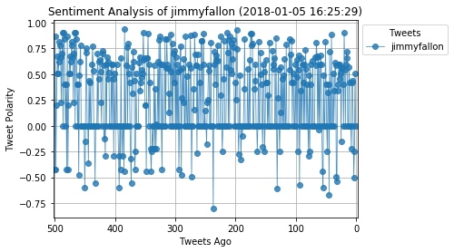

# InaPyBot

#### The bot receives tweets via mentions and in turn performs sentiment analysis on the most recent twitter account specified in the mention 
#### For example, when a user tweets, *"#InaPyBot @CNN"*  it will trigger a sentiment analysis on the CNN twitter feed.


```python
# Dependencies
import tweepy
import json
import numpy as np
import pandas as pd
import matplotlib.pyplot as plt
import time

#To get the current date
import datetime


# Import and Initialize Sentiment Analyzer
from vaderSentiment.vaderSentiment import SentimentIntensityAnalyzer
analyzer = SentimentIntensityAnalyzer()

# Twitter API Keys
consumer_key = "Your key here"
consumer_secret = "Your key here"
access_token = "Your key here"
access_token_secret = "Your key here"

# Setup Tweepy API Authentication
auth = tweepy.OAuthHandler(consumer_key, consumer_secret)
auth.set_access_token(access_token, access_token_secret)
api = tweepy.API(auth, parser=tweepy.parsers.JSONParser())

```


```python
def plot_sentiment(sentiment_df,user):
    sentiment_df.plot("Tweets Ago","Compound",marker="o", linewidth=0.8, alpha=0.8,linestyle="-",label=user)
    plt.legend(bbox_to_anchor = (1,1),title="Tweets")
    
    plt.xlabel("Tweets Ago")
    plt.ylabel("Tweet Polarity")
    plt.title("Sentiment Analysis of %s (%s)"%(user.replace("@",""),datetime.datetime.now().strftime('%Y-%m-%d %H:%M:%S')))
    
    plt.xlim(502,-2)
    plt.grid(True)
    filename = "PyBotOutput/Sentiment_Analysis_of_"+user.replace("@","")+".png"
    plt.savefig(filename,bbox_inches='tight')
    plt.show()
    return filename

```


```python
def Retrieve_Tweets(user):
    # Array to hold sentiment
    Sentiment_array = []
    # Setting the tweet count as 500
    tweetcount=500
    print("Extracting tweets from %s"%user)

    # Extracting  pages of tweets
    for x in range(25):
        public_tweets=api.user_timeline(user,page=x)
        # For each tweet 
        for tweet in public_tweets:
            #Calculating the compound,positive,negative and neutral value for each tweet
            compound = analyzer.polarity_scores(tweet["text"])["compound"]
            pos = analyzer.polarity_scores(tweet["text"])["pos"]
            neu = analyzer.polarity_scores(tweet["text"])["neu"]
            neg = analyzer.polarity_scores(tweet["text"])["neg"]
            # Store Tweet in Array
            Sentiment_array.append({"Media":user,
                                    "Tweet Text":tweet["text"],
                                    "Compound":compound,
                                    "Positive":pos,
                                    "Negative":neg,
                                    "Neutral":neu,
                                    "Date":tweet["created_at"],
                                    "Tweets Ago":tweetcount})
            #Decreasing tweet count by 1
            tweetcount-=1

    print("End of Extraction of Tweets")

    # Creating a dataframe from the Sentiment Array
    Sentiment_DF=pd.DataFrame.from_dict(Sentiment_array)
    # Removing the '@' from Media column in the data frame
    Sentiment_DF['Media'] = Sentiment_DF['Media'].map(lambda x: x.lstrip('@'))

    # Re_arranging the order of columns before saving into CSV file
    Sentiment_DF=Sentiment_DF[["Media","Date","Tweet Text","Compound","Positive","Negative","Neutral","Tweets Ago"]]
    filename=plot_sentiment(Sentiment_DF,user)
    return filename
```


```python
def Search_Request():
    # An array to store the neccessary information on each tweet
    Query_array=[]
    
    # If the file Request.csv exists 
    try:
        # Read the csv file
        Query_DF=pd.read_csv("PyBotOutput/Requests.csv")
        # Get the last id from the first row of the csv file
        lastid=Query_DF["Tweet ID"][Query_DF.index[0]]
        # Get the request using api.search
        request=api.search("#InaPyBot",since_id=lastid)
        
        
        # For each new tweet 
        for tweet in request["statuses"]:
            
            # Check if there is requests for user mention from the tweet
            if not(not tweet["entities"]["user_mentions"]):
                
                # Check if there is any previous request for that user mention with the content of csv file
                if Query_DF["User Request"].all()!=tweet["entities"]["user_mentions"][0]["screen_name"]:
                    # Appending the necessary details to the array
                    Query_array.append({"User Name":tweet["user"]["screen_name"],
                                "User Request":tweet["entities"]["user_mentions"][0]["screen_name"],
                                "Tweet ID":tweet["id"],
                                "Created On":tweet["created_at"]
                                })
                    # Retrieve and plot the graph for the requested user mention
                    filename=Retrieve_Tweets(tweet["entities"]["user_mentions"][0]["screen_name"])
                    reply_text="New Tweet Analysis: @%s (Thanks @%s)"%(
                            tweet["entities"]["user_mentions"][0]["screen_name"]
                           ,tweet["user"]["screen_name"])
                    # Reply to tweet with the image file
                    api.update_with_media(filename=filename,status=reply_text,in_reply_to_status_id=tweet["id"])
                    
                    # Convert the array into a dataframe
                    New_DF=pd.DataFrame.from_dict(Query_array)
                    # Append the new temporary array into the main dataframe
                    Query_DF=New_DF.append(Query_DF)
                    
                # If a previous request for that user mention has already been processed
                else:
                    print("The request for %s has already been processed"%tweet["entities"]["user_mentions"][0]["screen_name"])
                    # Try and error in case that status has already been processed and to avoid duplication error
                    try:
                        reply_text = "Thank you for your tweet @%s! Sorry, %s request has already been tweeted!"%(
                                tweet["user"]["screen_name"],
                                tweet["entities"]["user_mentions"][0]["screen_name"])
                        # Reply to tweet with the Sorry Message
                        api.update_status(reply_text,in_reply_to_status_id=tweet["id"])
                    except:
                        pass
    
            # If there is no request from user mentions then the Tweet request format is incorrect
            else:
                reply_text="@%s \nTweet text:%s \nError: Not in the specified format or doesnot have an existing user in Twitter"%(
                    tweet["user"]["screen_name"],tweet["text"])
                # Reply to tweet saying the format is incorrect
                api.update_status(reply_text,in_reply_to_status_id=tweet["id"])
                print(reply_text)
                
        
    # If the Request.csv file doesnot exist, this is mainly for the first time when the code is deployed
    except FileNotFoundError:
        
        # Placing the first tweet id of one from my timeline
        lastid=948692161024978945
        # Searching for tweets using the handle and since the last id
        request=api.search("#InaPyBot",since_id=lastid)
        
        # For each tweet in the response
        for tweet in request["statuses"]:
            
            # Check if there is requests for user mention from the tweet
            if not(not tweet["entities"]["user_mentions"]):
                # Appending the necessary details to the array
                Query_array.append({"User Name":tweet["user"]["screen_name"],
                                "User Request":tweet["entities"]["user_mentions"][0]["screen_name"],
                                "Tweet ID":tweet["id"],
                                "Created On":tweet["created_at"]
                                })
                # Retrieve and plot the graph for the requested user mention
                filename=Retrieve_Tweets(tweet["entities"]["user_mentions"][0]["screen_name"])
                reply_text="New Tweet Analysis: @%s (Thanks @%s)"%(
                        tweet["entities"]["user_mentions"][0]["screen_name"],
                        tweet["user"]["screen_name"])
                
                # Reply to tweet with the image file
                api.update_with_media(filename=filename,status=reply_text,in_reply_to_status_id=tweet["id"])
                # Append the array into the main dataframe
                Query_DF=pd.DataFrame.from_dict(Query_array)
            
            # If there is no request from user mentions then the Tweet request format is incorrect
            else:
                reply_text="@%s \nTweet text:%s \nError: Not in the specified format or doesnot have an existing user in Twitter"%(
                    tweet["user"]["screen_name"],tweet["text"])
                # Reply to tweet saying the format is incorrect
                api.update_status(reply_text,in_reply_to_status_id=tweet["id"])
                print(reply_text)

                
        #Query_DF=pd.DataFrame.from_dict(Query_array)
    
    Query_DF.to_csv("PyBotOutput/Requests.csv",index=False)
    
```


```python
while True:
    Search_Request()
    time.sleep(300)
```

    Extracting tweets from CNN
    End of Extraction of Tweets
    


    The request for CNN has already been processed
    Extracting tweets from TheEllenShow
    End of Extraction of Tweets
    


    Extracting tweets from DCComics
    End of Extraction of Tweets
    


    Extracting tweets from jimmyfallon
    End of Extraction of Tweets
    





    The request for CNN has already been processed
    


    ---------------------------------------------------------------------------

    KeyboardInterrupt                         Traceback (most recent call last)

    <ipython-input-5-ec84cac9951c> in <module>()
          1 while True:
          2     Search_Request()
    ----> 3     time.sleep(300)
    

    KeyboardInterrupt: 

